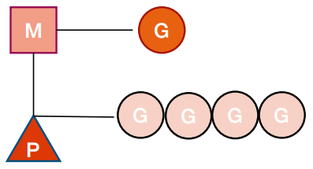

# 线程调度
## 深入理解 Go 语言线程调度
- 进程：资源分配的基本单位
- 线程：调度的基本单位
- 无论是线程还是进程，在 linux 中都以 task_struct 描述，从内核角度看，与进程无本质区别
- Glibc 中的 pthread 库提供 NPTL（Native POSIX Threading Library）支持

## Linux 进程的内存使用

```
➜  01syncmap git:(main) ✗ go build -o main main.go 
➜  01syncmap git:(main) ✗ ll 
总用量 1.2M
-rwxrwxr-x 1 cjx cjx 1.2M 9月  12 19:55 main
-rw-rw-r-- 1 cjx cjx  716 9月  12 17:38 main.go
➜  01syncmap git:(main) ✗ size main 
   text    data     bss     dec     hex filename
 785989   16432  212840 1015261   f7ddd main
➜  01syncmap git:(main) ✗ objdump -x main
......
000000000041c1c0 g     F .text  000000000000033e runtime.(*pallocData).findScavengeCandidate
000000000041c500 g     F .text  0000000000000125 runtime.(*stackScanState).putPtr
000000000041c640 g     F .text  000000000000013a runtime.(*stackScanState).getPtr
......
00000000004587c0 g     F .text  000000000000004c main.(*SafeMap).Write.dwrap.2
00000000004c21a0 g     O .noptrdata     0000000000000028 main..inittask
00000000004c2320 g     O .noptrdata     0000000000000038 sync..inittask
00000000004c6138 g     O .bss   0000000000000008 sync.expunged
00000000004c6390 g     O .bss   0000000000000018 sync.allPools
00000000004c63b0 g     O .bss   0000000000000018 sync.oldPools
......
00000000004c6068 g     O .bss   0000000000000008 _cgo_sigaction
000000000047c940 g     O .rodata        0000000000000008 runtime.mainPC
000000000047dbc8 g     O .rodata        0000000000000070 go.itab.*internal/reflectlite.rtype,internal/reflectlite.Type
000000000047ca00 g     O .rodata        000000000000000e runtime.defaultGOROOT.str
000000000047c970 g     O .rodata        0000000000000009 runtime.buildVersion.str
0000000000459000 g     O .rodata        0000000000000000 type.*
000000000047cb10 g     O .rodata        0000000000000018 runtime.textsectionmap
```
查看页大小
```
➜  01syncmap git:(main) ✗ getconf PAGESIZE
4096
➜  01syncmap git:(main) ✗ getconf PAGE_SIZE
4096
```
## CPU 对内存的访问
- CPU 上有个 Memory Management Unit（MMU） 单元
- CPU 把虚拟地址给 MMU，MMU 去物理内存中查询页表，得到实际的物理地址
- CPU 维护一份缓存 Translation Lookaside Buffer（TLB），缓存虚拟地址和物理地址的映射关系

## 进程切换开销
- 直接开销
    - 切换页表全局目录（PGD） 
    - 切换内核态堆栈
    - 切换硬件上下文（进程恢复前，必须装入寄存器的数据统称为硬件上下文）
    - 刷新 TLB
    - 系统调度器的代码执行
- 间接开销
    - CPU 缓存失效导致的进程需要到内存直接访问的 IO 操作变多
## 线程切换开销
- 线程本质上只是一批共享资源的进程，线程切换本质上依然需要内核进行进程切换
- 一组线程因为共享内存资源，因此一个进程的所有线程共享虚拟地址空间，线程切换相比进程切换，<font color=orange>主要节省了虚拟地址空间的切换</font>
## 用户线程
无需内核帮助，应用程序在用户空间创建的可执行单元，创建销毁完全在用户态完成。

## Goroutine
Go 语言基于 GMP 模型实现用户态线程
- Goroutine：表示 goroutine，每个 goroutine 都有自己的栈空间，定时器，初始化的栈空间在 2k 左右，空间会随着需求增长。
- Machine：抽象化代表内核线程，记录内核线程栈信息，当goroutine 调度到线程时，使用该 goroutine 自己的栈信息。
- Process：代表调度器，负责调度 goroutine，维护一个本地goroutine 队列，M 从 P 上获得 goroutine 并执行，同时还负责部分内存的管理。

## MPG 的对应关系

## GMP 模型细节

## P 的状态
- _Pidle ：处理器没有运行用户代码或者调度器，被空闲队列或者改变其状态的结构持有，运行队列为空
- _Prunning ：被线程 M 持有，并且正在执行用户代码或者调度器
- _Psyscall：没有执行用户代码，当前线程陷入系统调用
- _Pgcstop ：被线程 M 持有，当前处理器由于垃圾回收被停止
- _Pdead ：当前处理器已经不被使用

## G 的状态
- _Gidle：刚刚被分配并且还没有被初始化，值为0，为创建 goroutine 后的默认值
- _Grunnable： 没有执行代码，没有栈的所有权，存储在运行队列中，可能在某个P的本地队列或全局队列中(如上图)。 
- _Grunning： 正在执行代码的 goroutine，拥有栈的所有权
- _Gsyscall：正在执行系统调用，拥有栈的所有权，与 P 脱离，但是与某个 M 绑定，会在调用结束后被分配到运行队列
- _Gwaiting：被阻塞的 goroutine，阻塞在某个 channel 的发送或者接收队列
- _Gdead： 当前 goroutine 未被使用，没有执行代码，可能有分配的栈，分布在空闲列表 gFree，可能是一个刚刚初始化的goroutine，也可能是执行了 goexit 退出的 goroutine
- _Gcopystac：栈正在被拷贝，没有执行代码，不在运行队列上，执行权在
- _Gscan ： GC 正在扫描栈空间，没有执行代码，可以与其他状态同时存在
### G的状态转换图

### G 所处的位置
- 进程都有一个全局的 G 队列
- 每个 P 拥有自己的本地执行队列
- 有不在运行队列中的 G 
    - 处于 channel 阻塞态的 G 被放在 sudog
    - 脱离 P 绑定在 M 上的 G，如系统调用
    - 为了复用，执行结束进入 P 的 gFree 列表中的 G
## Goroutine 创建过程
- 获取或者创建新的 Goroutine 结构体
    - <font color=orange>从处理器的 gFree 列表中查找空闲的 Goroutine</font>
    - <font color=orange>如果不存在空闲的 Goroutine，会通过 runtime.malg 创建一个栈大小足够的新结构体</font>
- 将函数传入的参数移到 Goroutine 的栈上
- 更新 Goroutine 调度相关的属性，更新状态为_Grunnable
- 返回的 Goroutine 会存储到全局变量 allgs 中
## 将 Goroutine 放到运行队列上
- Goroutine 设置到处理器的 runnext 作为下一个处理器执行的任务
- 当处理器的<font color=orange>本地运行队列已经没有剩余空间时(256)</font>，就会把本地队列中的一部分 Goroutine 和待加入的Goroutine 通过 <font color=orange>runtime.runqputslow 添加到调度器持有的全局运行队列上</font>
## 调度器行为
- 为了保证公平，当全局运行队列中有待执行的 Goroutine 时，通过 schedtick 保证有一定几率(1/61)会从<font color=orange>全局的运行队列</font>中查找对应的 Goroutine
- 从处理器<font color=orange>本地的运行队列</font>中查找待执行的 Goroutine
- 如果前两种方法都没有找到 Goroutine，会通过 runtime.findrunnable <font color=orange>进行阻塞地查找</font>Goroutine
    - 从本地运行队列、全局运行队列中查找
    - 从网络轮询器中查找是否有 Goroutine 等待运行
    - 通过 runtime.runqsteal 尝试从其他随机的处理器中窃取一半待运行的 Goroutine
## 课后练习 2.1
> [code](https://github.com/mkbooks-codes/k8s-mengfanjie/blob/main/01golang/01examples/02module/06homework/main.go)

- 将练习 1.2 中的生产者消费者模型修改成为多个生产者和多个消费者模式