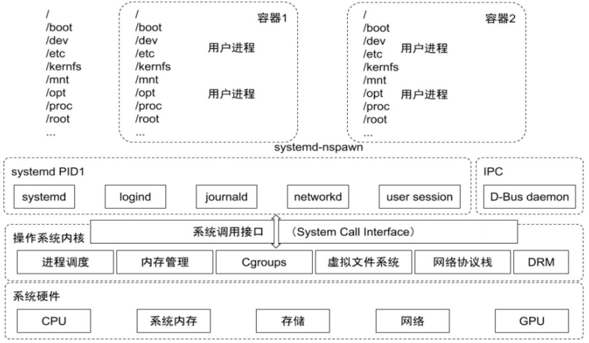
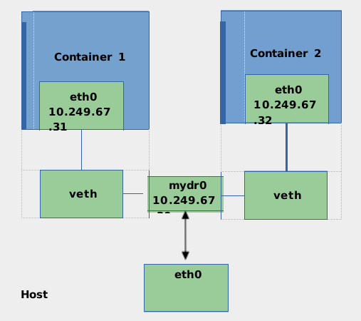
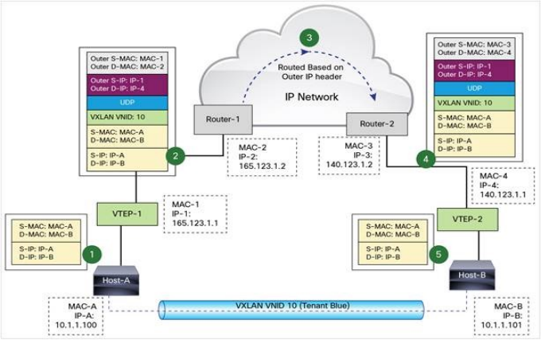
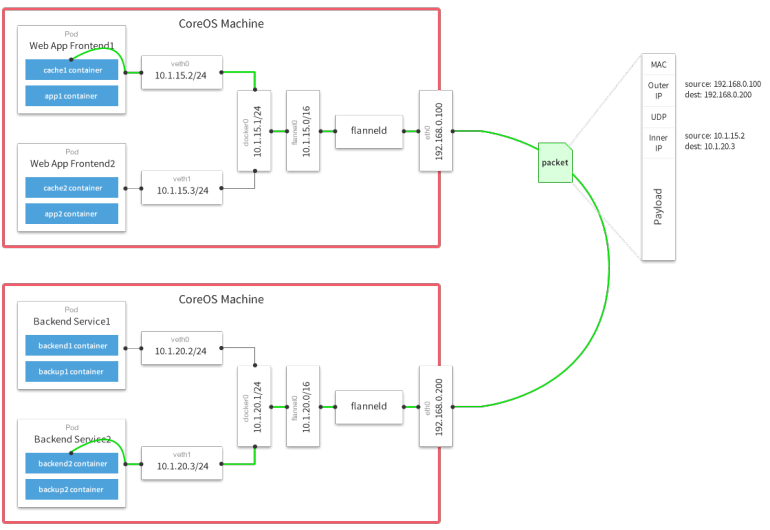
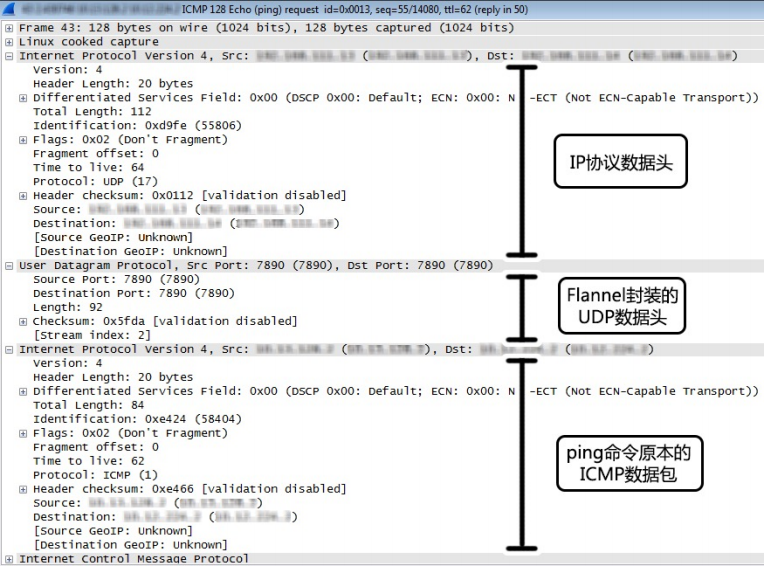

# 理解 Docker
## Docker
- 基于 Linux 内核的 Cgroup，Namespace，以及 Union FS 等技术，对进程进行封装隔离，属于操作系统层面的虚拟化技术，由于隔离的进程独立于宿主和其它的隔离的进程，因此也称其为容器。
- 最初实现是基于 LXC，从 0.7 以后开始去除 LXC，转而使用自行开发的 Libcontainer，从 1.11 开始，则进一步演进为使用 runC 和 Containerd。 
- Docker 在容器的基础上，进行了进一步的封装，从文件系统、网络互联到进程隔离等等，极大的简化了容器的创建和维护，使得 Docker 技术比虚拟机技术更为轻便、快捷。

## 为什么要用 Docker
- 更高效地利用系统资源
- 更快速的启动时间
- 一致的运行环境
- 持续交付和部署
- 更轻松地迁移
- 更轻松地维护和扩展
- ......

## 虚拟机和容器运行态的对比


### 性能对比


## 安装 Docker
在 ubuntu 上安装 Docker 运行时，参考 https://docs.docker.com/engine/install/ubuntu/
```
$ sudo apt-get update
$ sudo apt-get install \
    apt-transport-https \
    ca-certificates \
    curl \
    gnupg-agent \
    software-properties-common
$ curl -fsSL https://download.docker.com/linux/ubuntu/gpg | sudo apt-key add -
$ sudo add-apt-repository \
    "deb [arch=amd64] https://download.docker.com/linux/ubuntu \
    $(lsb_release -cs) \
    stable"
$ sudo apt-get update
$ sudo apt-get install docker-ce docker-ce-cli containerd.io
```

## 容器操作
启动：

- docker run
    - -it 交互
    - -d 后台运行
    - -p 端口映射
    - -v 磁盘挂载
- 启动已终止容器
    - docker start
- 停止容器
    - docker stop
- 查看容器进程
    - docker ps
- 查看容器细节：
    - docker inspect <containerid> 
- 进入容器；
- Docker attach：
    - 通过 nsenter
    - PID=$(docker inspect --format "{{ .State.Pid }}" <container>)
    - $ nsenter --target $PID --mount --uts --ipc --net --pid
- 拷贝文件至容器内：
    - docker cp file1 <containerid>:/file-to-path

## 初识容器
- cat Dockerfile
```
FROM ubuntu
ENV MY_SERVICE_PORT=80
ADD bin/amd64/httpserver /httpserver
ENTRYPOINT /httpserver
```
- 将 Dockerfile 打包成镜像
```
docker build -t cncamp/httpserver:${tag} .
docker push cncamp/httpserver:v1.0
```
- 运行容器
```
docker run -d cncamp/httpserver:v1.0
```

## 容器标准
- Open Container Initiative（OCI） 
    - 轻量级开放式管理组织（项目）
- OCI 主要定义两个规范
    - Runtime Specification
        - 文件系统包如何解压至硬盘，共运行时运行。
    - Image Specification
        - 如何通过构建系统打包，生成镜像清单（Manifest）、文件系统序列化文件、镜像配置。

## 容器主要特性


### Namespace
- Linux Namespace 是一种 Linux Kernel 提供的资源隔离方案：
    - 系统可以为进程分配不同的 Namespace； 
    - 并保证不同的 Namespace 资源独立分配、进程彼此隔离，即不同的 Namespace 下的进程互不干扰 。

#### Linux 内核代码中 Namespace 的实现
- 进程数据结构
```
struct task_struct {
    ...
    /* namespaces */
    struct nsproxy *nsproxy;
    ...
}
```
- Namespace 数据结构
```
struct nsproxy {
    atomic_t count;
    struct uts_namespace *uts_ns;
    struct ipc_namespace *ipc_ns;
    struct mnt_namespace *mnt_ns;
    struct pid_namespace
    *pid_ns_for_children;
    struct net *net_ns; 
}
```
#### Linux 对 Namespace 操作方法
- <b>clone</b>

在创建新进程的系统调用时，可以通过 flags 参数指定需要新建的 Namespace 类型：

// CLONE_NEWCGROUP / CLONE_NEWIPC / CLONE_NEWNET / CLONE_NEWNS / CLONE_NEWPID / CLONE_NEWUSER / CLONE_NEWUTS

int clone(int (*fn)(void *), void *child_stack, int flags, void *arg) 

- <b>setns</b>

该系统调用可以让调用进程加入某个已经存在的 Namespace 中：
Int setns(int fd, int nstype) 

- <b>unshare</b>

该系统调用可以将调用进程移动到新的 Namespace 下：
int unshare(int flags)

#### 隔离性 – Linux Namespace


#### 隔离性 - Linux Namespace
- <font color=red>Pid namespace</font>
    - 不同用户的进程就是通过 Pid namespace 隔离开的，且不同 namespace 中可以有相同 Pid。 
    - 有了 Pid namespace, 每个 namespace 中的 Pid 能够相互隔离。
- <font color=red>net namespace</font>
    - 网络隔离是通过 net namespace 实现的， 每个 net namespace 有独立的 network devices, IP addresses, IP routing tables, /proc/net 目录。 
    - Docker 默认采用 veth 的方式将 container 中的虚拟网卡同 host 上的一个 docker bridge: docker0 连接在一起。
- <font color=red>ipc namespace</font>
    - Container 中进程交互还是采用 linux 常见的进程间交互方法 （interprocess communication – IPC）, 包括常见的信号量、消息队列和共享内存。 
    - container 的进程间交互实际上还是 host上 具有相同 Pid namespace 中的进程间交互，因此需要在 IPC资源申请时加入 namespace 信息 - 每个 IPC 资源有一个唯一的 32 位 ID。
- <font color=red>mnt namespace</font>
    - mnt namespace 允许不同 namespace 的进程看到的文件结构不同，这样每个 namespace 中的进程所看到的文件目录就被隔离开了。
- <font color=red>uts namespace</font>
    - UTS(“UNIX Time-sharing System”) namespace允许每个 container 拥有独立的 hostname 和 domain name, 使其在网络上可以被视作一个独立的节点而非 Host 上的一个进程。
- <font color=red>user namespace</font>
    - 每个 container 可以有不同的 user 和 group id, 也就是说可以在 container 内部用 container 内部的用户执行程序而非 Host 上的用户。

#### 关于 namespace 的常用操作
- 查看当前系统的 namespace：
```
lsns –t <type>
```
- 查看某进程的 namespace：
```
ls -la /proc/<pid>/ns/
```
- 进入某 namespace 运行命令：
```
nsenter -t <pid> -n ip addr
```
#### Namespace 练习
- 在新 network namespace 执行 sleep 指令： 
```
unshare -fn sleep 60
```
- 查看进程信息
```
ps -ef|grep sleep
root 32882 4935 0 10:00 pts/0 00:00:00 unshare -fn sleep 60
root 32883 32882 0 10:00 pts/0 00:00:00 sleep 60
```
- 查看网络 Namespace
```
lsns -t net
4026532508 net 2 32882 root unassigned unshare
```
- 进入改进程所在 Namespace 查看网络配置，与主机不一致
```
nsenter -t 32882 -n ip a
1: lo: <LOOPBACK> mtu 65536 qdisc noop state DOWN group default qlen 1000
link/loopback 00:00:00:00:00:00 brd 00:00:00:00:00:00
```
### Cgroups
- Cgroups （Control Groups）是 Linux 下用于对一个或一组进程进行资源控制和监控的机制；
- 可以对诸如 CPU 使用时间、内存、磁盘 I/O 等进程所需的资源进行限制；
- 不同资源的具体管理工作由相应的 Cgroup 子系统（Subsystem）来实现 ； 
- 针对不同类型的资源限制，只要将限制策略在不同的的子系统上进行关联即可 ； 
- Cgroups 在不同的系统资源管理子系统中以层级树（Hierarchy）的方式来组织管理：每个 Cgroup 都可以包含其他的子 Cgroup，因此子 Cgroup 能使用的资源除了受本 Cgroup 配置的资源参数限制，还受到父Cgroup 设置的资源限制 。
#### Linux 内核代码中 Cgroups 的实现
- 进程数据结构 
```
struct task_struct
{
    #ifdef CONFIG_CGROUPS
    struct css_set __rcu *cgroups; 
    struct list_head cg_list; 
    #endif
}
```
- css_set 是 cgroup_subsys_state 对象的集合数据结构
```
struct css_set {
    /*
    * Set of subsystem states, one for each subsystem. This array is
    * immutable after creation apart from the init_css_set during
    * subsystem registration (at boot time).
    */
    struct cgroup_subsys_state *subsys[CGROUP_SUBSYS_COUNT];
};
```
#### 可配额/可度量 - Control Groups (cgroups)


cgroups 实现了对资源的配额和度量

- <font color=orange>blkio:   </font> 这个子系统设置限制每个块设备的输入输出控制。例如:磁盘，光盘以及 USB 等等。
- <font color=orange>CPU:     </font> 这个子系统使用调度程序为 cgroup 任务提供 CPU 的访问。
- <font color=orange>cpuacct: </font> 产生 cgroup 任务的 CPU 资源报告。
- <font color=orange>cpuset:  </font> 如果是多核心的 CPU，这个子系统会为 cgroup 任务分配单独的 CPU 和内存。
- <font color=orange>devices: </font> 允许或拒绝 cgroup 任务对设备的访问。
- <font color=orange>freezer: </font> 暂停和恢复 cgroup 任务。
- <font color=orange>memory:  </font> 设置每个 cgroup 的内存限制以及产生内存资源报告。
- <font color=orange>net_cls: </font> 标记每个网络包以供 cgroup 方便使用。
- <font color=orange>ns:      </font> 名称空间子系统。
- <font color=orange>pid:     </font> 进程标识子系统。
#### CPU 子系统


- <font color=orange>cpu.shares：</font> 可出让的能获得 CPU 使用时间的相对值。
- <font color=orange>cpu.cfs_period_us: </font> cfs_period_us 用来配置时间周期长度，单位为 us（微秒）。
- <font color=orange>cpu.cfs_quota_us：</font> cfs_quota_us 用来配置当前 Cgroup 在 cfs_period_us 时间内最多能使用的 CPU 时间数，单位为 us（微秒）。
- <font color=orange>cpu.stat: </font> Cgroup 内的进程使用的 CPU 时间统计。
- <font color=orange>nr_periods: </font> 经过 cpu.cfs_period_us 的时间周期数量。
- <font color=orange>nr_throttled: </font> 在经过的周期内，有多少次因为进程在指定的时间周期内用光了配额时间而受到限制。
- <font color=orange>throttled_time: </font> Cgroup 中的进程被限制使用 CPU 的总用时，单位是 ns（纳秒）。
#### Linux 调度器
内核默认提供了5个调度器，Linux 内核使用 struct sched_class 来对调度器进行抽象：

- Stop 调度器，stop_sched_class：优先级最高的调度类，可以抢占其他所有进程，不能被其他进程抢占；
- Deadline 调度器，dl_sched_class：使用红黑树，把进程按照绝对截止期限进行排序，选择最小进程进行调度运行；
- RT 调度器， rt_sched_class：实时调度器，为每个优先级维护一个队列；
- <font color=orange>CFS 调度器， cfs_sched_class：完全公平调度器，采用完全公平调度算法，引入虚拟运行时间概念；</font>
- IDLE-Task 调度器， idle_sched_class：空闲调度器，每个 CPU 都会有一个 idle 线程，当没有其他进程可以调度时，调度运行 idle 线程。
#### CFS 调度器
- CFS 是 Completely Fair Scheduler 简称，即完全公平调度器。
- CFS 实现的主要思想是维护为任务提供处理器时间方面的平衡，这意味着应给进程分配相当数量的处理器。
- 分给某个任务的时间失去平衡时，应给失去平衡的任务分配时间，让其执行。
- CFS 通过虚拟运行时间（vruntime）来实现平衡，维护提供给某个任务的时间量。
- vruntime = 实际运行时间*1024 / 进程权重
- 进程按照各自不同的速率在物理时钟节拍内前进，优先级高则权重大，其虚拟时钟比真实时钟跑得慢，但获得比较多的运行时间。
#### vruntime 红黑树
CFS 调度器没有将进程维护在运行队列中，而是维护了一个以虚拟运行时间为顺序的红黑树。 红黑树的主要特点有：

1. 自平衡，树上没有一条路径会比其他路径长出俩倍。
2. O(log n) 时间复杂度，能够在树上进行快速高效地插入或删除进程。

#### CFS进程调度
- 在时钟周期开始时，调度器调用 __schedule() 函数来开始调度的运行。
- __schedule() 函数调用 pick_next_task() 让进程调度器从就绪队列中选择一个最合适的进程 next，即红黑树最左边的节点。
- 通过 context_switch() 切换到新的地址空间，从而保证 next 进程运行。
- 在时钟周期结束时，调度器调用 entity_tick() 函数来更新进程负载、进程状态以及 vruntime（当前vruntime + 该时钟周期内运行的时间）。
- 最后，将该进程的虚拟时间与就绪队列红黑树中最左边的调度实体的虚拟时间做比较，如果小于坐左边的时间，则不用触发调度，继续调度当前调度实体。

#### CPU 子系统练习
- 在 cgroup cpu 子系统目录中创建目录结构
```
cd /sys/fs/cgroup/cpu
mkdir cpudemo
cd cpudemo
```
- 运行 busyloop
- 执行 top 查看 CPU 使用情况，CPU 占用 200%
- 通过 cgroup 限制 cpu
```
cd /sys/fs/cgroup/cpu/cpudemo
```
- 把进程添加到 cgroup 进程配置组
```
echo ps -ef|grep busyloop|grep -v grep|awk '{print $2}' > cgroup.procs
```
- 设置 cpuquota
```
echo 10000 > cpu.cfs_quota_us
```
- 执行 top 查看 CPU 使用情况，CPU 占用变为10%
#### cpuacct 子系统
用于统计 Cgroup 及其子 Cgroup 下进程的 CPU 的使用情况。

- cpuacct.usage

包含该 Cgroup 及其子 Cgroup 下进程使用 CPU 的时间，单位是 ns（纳秒）。

- cpuacct.stat

包含该 Cgroup 及其子 Cgroup 下进程使用的 CPU 时间，以及用户态和内核态的时间。
#### Memory 子系统
- memory.usage_in_bytes
cgroup 下进程使用的内存，包含 cgroup 及其子 cgroup 下的进程使用的内存
- memory.max_usage_in_bytes
cgroup 下进程使用内存的最大值，包含子 cgroup 的内存使用量。
- memory.limit_in_bytes
设置 Cgroup 下进程最多能使用的内存。如果设置为 -1，表示对该 cgroup 的内存使用不做限制。
- memory.soft_limit_in_bytes
这个限制并不会阻止进程使用超过限额的内存，只是在系统内存足够时，会优先回收超过限额的内存，使之向限定值靠拢。
- memory.oom_control

<font color=orange>设置是否在 Cgroup 中使用 OOM（Out of Memory）Killer，默认为使用。当属于该 cgroup 的进程使用的内存超过最大的限定值时，会立刻被 OOM Killer 处理。</font>

#### Cgroup driver
systemd:

- 当操作系统使用 systemd 作为 init system 时，初始化进程生成一个根 cgroup 目录结构并作为 cgroup管理器。
- systemd 与 cgroup 紧密结合，并且为每个 systemd unit 分配 cgroup。 

cgroupfs:

- docker 默认用 cgroupfs 作为 cgroup 驱动。

存在问题：

- 在 systemd 作为 init system 的系统中，默认并存着两套 groupdriver。 
- 这会使得系统中 Docker 和 kubelet 管理的进程被 cgroupfs 驱动管，而 systemd 拉起的服务由systemd 驱动管，让 cgroup 管理混乱且容易在资源紧张时引发问题。

<font color=orange>因此 kubelet 会默认--cgroup-driver=systemd，若运行时 cgroup 不一致时，kubelet 会报错。</font>

#### 课后练习3.1
- Memory 子系统练习
- 在 cgroup memory 子系统目录中创建目录结构
```
cd /sys/fs/cgroup/memory
mkdir memorydemo
cd memorydemo
```
- 运行 malloc（在linux机器make build） 
- 查看内存使用情况
```
watch 'ps -aux|grep malloc|grep -v grep‘
```
- 通过 cgroup 限制 memory
- 把进程添加到cgroup进程配置组
```
echo ps -ef|grep malloc |grep -v grep|awk '{print $2}' > cgroup.procs
```
- 设置 memory.limit_in_bytes
```
echo 104960000 > memory.limit_in_bytes
```
- 等待进程被 oom kill

### 文件系统
Union FS

- 将不同目录挂载到同一个虚拟文件系统下 （unite several directories into a single virtual filesystem）的文件系统
- 支持为每一个成员目录（类似Git Branch）设定 readonly、readwrite 和 whiteout-able 权限
- 文件系统分层, 对 readonly 权限的 branch 可以逻辑上进行修改(增量地, 不影响 readonly 部分的)。 
- 通常 Union FS 有两个用途, 一方面可以将多个 disk 挂到同一个目录下, 另一个更常用的就是将一个readonly 的 branch 和一个 writeable 的 branch 联合在一起。

### 容器镜像


### Docker 的文件系统
典型的 Linux 文件系统组成：

- Bootfs（boot file system） 
    - Bootloader - 引导加载 kernel， 
    - Kernel - 当 kernel 被加载到内存中后 umount bootfs。 
- rootfs （root file system） 
    - /dev，/proc，/bin，/etc 等标准目录和文件。 
    - 对于不同的 linux 发行版, bootfs 基本是一致的，但 rootfs 会有差别。


### Docker 启动
Linux

- 在启动后，首先将 rootfs 设置为 readonly, 进行一系列检查, 然后将其切换为 “readwrite”供用户使用。Docker 启动
- 初始化时也是将 rootfs 以 readonly 方式加载并检查，然而接下来利用 union mount 的方式将一个readwrite 文件系统挂载在 readonly 的 rootfs 之上； - 并且允许再次将下层的 FS（file system） 设定为 readonly 并且向上叠加。 
- 这样一组 readonly 和一个 writeable 的结构构成一个 container 的运行时态, 每一个 FS 被称作一个 FS层。


### 写操作
由于镜像具有共享特性，所以对容器可写层的操作需要依赖存储驱动提供的写时复制和用时分配机制，以此来支持对容器可写层的修改，进而提高对存储和内存资源的利用率。

- <font color=orange>写时复制</font>
    - 写时复制，即 Copy-on-Write。 
    - 一个镜像可以被多个容器使用，但是不需要在内存和磁盘上做多个拷贝。
    - 在需要对镜像提供的文件进行修改时，该文件会从镜像的文件系统被复制到容器的可写层的文件系统进行修改，而镜像里面的文件不会改变。
    - 不同容器对文件的修改都相互独立、互不影响。
- <font color=orange>用时分配</font>
    - 按需分配空间，而非提前分配，即当一个文件被创建出来后，才会分配空间。

### 容器存储驱动


#### 以 OverlayFS 为例
OverlayFS 也是一种与 AUFS 类似的联合文件系统，同样属于文件级的存储驱动，包含了最初的 Overlay 和更新更稳定的 overlay2。

<font color=orange>Overlay 只有两层：upper 层和 lower 层，Lower 层代表镜像层，upper 层代表容器可写层。</font>


#### OverlayFS 文件系统练习
```
$ mkdir upper lower merged work
$ echo "from lower" > lower/in_lower.txt
$ echo "from upper" > upper/in_upper.txt
$ echo "from lower" > lower/in_both.txt
$ echo "from upper" > upper/in_both.txt
$ sudo mount -t overlay overlay -o lowerdir=`pwd`/lower,upperdir=`pwd`/upper,workdir=`pwd`/work `pwd`/merged
$ cat merged/in_both.txt
$ delete merged/in_both.txt
$ delete merged/in_lower.txt
$ delete merged/in_upper.txt 
```
### OCI 容器标准
Open Container Initiative

- OCI 组织于 2015 年创建，是一个致力于定义容器镜像标准和运行时标准的开放式组织。
- OCI 定义了镜像标准（Runtime Specification）、运行时标准（Image Specification）和分发标准（Distribution Specification） 
    - 镜像标准定义应用如何打包
    - 运行时标准定义如何解压应用包并运行
    - 分发标准定义如何分发容器镜像

### Docker 引擎架构


### 网络
<font color=red>Null(--net=None)</font>

- 把容器放入独立的网络空间但不做任何网络配置； 
- 用户需要通过运行 docker network 命令来完成网络配置。

<font color=red>Host</font>

- 使用主机网络名空间，复用主机网络。

<font color=red>Container</font>

- 重用其他容器的网络。

<font color=red>Bridge(--net=bridge)</font>

- 使用 Linux 网桥和 iptables 提供容器互联，Docker 在每台主机上创建一个名叫 docker0 的网桥，通过 veth pair 来连接该主机的每一个 EndPoint。

<font color=red>Overlay(libnetwork, libkv)</font>

- 通过网络封包实现。

<font color=red>Remote(work with remote drivers)</font>

- Underlay： 
    - 使用现有底层网络，为每一个容器配置可路由的网络 IP。 
- Overlay： 
    - 通过网络封包实现。

#### Null 模式
- Null 模式是一个空实现；
- 可以通过 Null 模式启动容器并在宿主机上通过命令为容器配置网络。
```
mkdir -p /var/run/netns
find -L /var/run/netns -type l -delete
ln -s /proc/$pid/ns/net /var/run/netns/$pid
ip link add A type veth peer name B
brctl addif br0 A
ip link set A up
ip link set B netns $pid
ip netns exec $pid ip link set dev B name eth0
ip netns exec $pid ip link set eth0 up
ip netns exec $pid ip addr add 
$SETIP/$SETMASK dev eth0
ip netns exec $pid ip route add default via 
$GATEWAY
```
#### 默认模式– 网桥和 NAT
为主机 eth0 分配 IP 192.168.0.101；

启动 docker daemon，查看主机 iptables； 

- POSTROUTING -A POSTROUTING -s 172.17.0.0/16 ! -o docker0 -j MASQUERADE

在主机启动容器：

- docker run -d --name ssh -p 2333:22 centos-ssh
- Docker 会以标准模式配置网络：
    - 创建 veth pair； 
    - 将 veth pair的一端连接到 docker0 网桥；
    - veth pair 的另外一端设置为容器名空间的 eth0； 
    - 为容器名空间的 eth0 分配 ip； 
    - 主机上的 Iptables 规则：PREROUTING -A DOCKER ! -i docker0 -p tcp -m tcp --dport 2333 -j DNAT --to-destination 172.17.0.2:22。

#### Underlay
- 采用 Linux 网桥设备（sbrctl），通过物理网络连通容器；
- 创建新的网桥设备 mydr0； 
- 将主机网卡加入网桥；
- 把主机网卡的地址配置到网桥，并把默认路由规则转移到网桥 mydr0； 
- 启动容器；
- 创建 veth 对，并且把一个 peer 添加到网桥 mydr0； 
- 配置容器把 veth 的另一个 peer 分配给容器网卡；

#### Docker Libnetwork Overlay
- Docker overlay 网络驱动原生支持多主机网络；
- Libnetwork 是一个内置的基于 VXLAN 的网络驱动。

#### VXLAN



#### Overlay network sample – Flannel
- 同一主机内的 Pod 可以使用网桥进行通信。
- 不同主机上的 Pod 将通过flanneld 将其流量封装在 UDP数据包中 。


#### Flannel packet sample


#### 创建 docker 镜像
定义 dockerfile
```
FROM ubuntu
# so apt-get doesn't complain
ENV DEBIAN_FRONTEND=noninteractive
RUN sed -i 's/^exit 101/exit 0/' /usr/sbin/policy-rc.d
RUN \
    apt-get update && \
    apt-get install -y ca-certificates && \
    apt-get install -y curl && \
    rm -rf /var/lib/apt/lists/*
ADD ./bin/eic eic
ENTRYPOINT ["/eic"]
```
```
docker build
```
