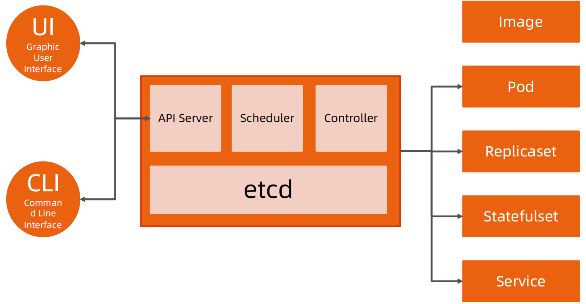

# 深入理解 Kubernetes
## 云计算的传统分类


## Kubernetes 生态系统


## Kubernetes 设计理念


## Kubernetes Master


## 分层架构
- <font color=blue>核心层</font>：Kubernetes 最核心的功能，对外提供 API 构建高层的应用，对内提供插件式应用执行环境。 
- <font color=blue>应用层</font>：部署（无状态应用、有状态应用、批处理任务、集群应用等）和路由（服务发现、DNS 解析等）。 
- <font color=blue>管理层</font>：系统度量（如基础设施、容器和网络的度量）、自动化（如自动扩展、动态 Provision 等）、策略管理（RBAC、Quota、PSP、NetworkPolicy 等）。 
- <font color=blue>接口层</font>：Kubectl 命令行工具、客户端 SDK 以及集群联邦。 
- <font color=blue>生态系统</font>：在接口层之上的庞大容器集群管理调度的生态系统，可以划分为两个范畴：
    - Kubernetes 外部：日志、监控、配置管理、CI、CD、Workflow、FaaS、OTS 应用、ChatOps 等；
    - Kubernetes 内部：CRI、CNI、CVI、镜像仓库、Cloud Provider、集群自身的配置和管理等。


<br>


## API 设计原则
- <font color=blue>所有 API 都应是声明式的</font>
    - 相对于命令式操作，声明式操作对于重复操作的效果是稳定的，这对于容易出现数据丢失或重复的分布式环境来说是很重要的。 
    - 声明式操作更易被用户使用，可以使系统向用户隐藏实现的细节，同时也保留了系统未来持续优化的可能性。 
    - 此外，声明式的 API 还隐含了所有的 API 对象都是名词性质的，例如 Service、Volume 这些 API 都是名词，这些名词描述了用户所期望得到的一个目标对象。 
- <font color=blue>API 对象是彼此互补而且可组合的</font>
    - 这实际上鼓励 API 对象尽量实现面向对象设计时的要求，即“高内聚，松耦合”，对业务相关的概念有一个合适的分解，提高分解出来的对象的可重用性。 
- <font color=blue>高层 API 以操作意图为基础设计</font>
    - 如何能够设计好 API，跟如何能用面向对象的方法设计好应用系统有相通的地方，高层设计一定是从业务出发，而不是过早的从技术实现出发。 
    - 因此，针对 Kubernetes 的高层 API 设计，一定是以 Kubernetes 的业务为基础出发，也就是以系统调度管理容器的操作意图为基础设计。
- <font color=blue>低层 API 根据高层 API 的控制需要设计</font>
    - 设计实现低层 API 的目的，是为了被高层 API 使用，考虑减少冗余、提高重用性的目的，低层 API的设计也要以需求为基础，要尽量抵抗受技术实现影响的诱惑。 
- <font color=blue>尽量避免简单封装，不要有在外部 API 无法显式知道的内部隐藏的机制</font>
    - 简单的封装，实际没有提供新的功能，反而增加了对所封装 API 的依赖性。 
    - 例如 StatefulSet 和 ReplicaSet，本来就是两种 Pod 集合，那么 Kubernetes 就用不同 API 对象来定义它们，而不会说只用同一个 ReplicaSet，内部通过特殊的算法再来区分这个 ReplicaSet 是有状态的还是无状态。
- <font color=blue>API 操作复杂度与对象数量成正比</font>
    - API 的操作复杂度不能超过 O(N)，否则系统就不具备水平伸缩性了。 
- <font color=blue>API 对象状态不能依赖于网络连接状态</font>
    - 由于众所周知，在分布式环境下，网络连接断开是经常发生的事情，因此要保证 API 对象状态能应对网络的不稳定，API 对象的状态就不能依赖于网络连接状态。
- <font color=blue>尽量避免让操作机制依赖于全局状态</font>
    - 因为在分布式系统中要保证全局状态的同步是非常困难的。

## Kubernetes 如何通过对象的组合完成业务描述


## 架构设计原则
- 只有 APIServer 可以直接访问 etcd 存储，其他服务必须通过 KubernetesAPI 来访问集群状态；
- 单节点故障不应该影响集群的状态；
- 在没有新请求的情况下，所有组件应该在故障恢复后继续执行上次最后收到的请求（比如网络分区或服务重启等）；
- 所有组件都应该在内存中保持所需要的状态，APIServer 将状态写入 etcd 存储，而其他组件则通过 APIServer 更新并监听所有的变化；
- 优先使用事件监听而不是轮询。

## 引导（Bootstrapping）原则
- Self-hosting 是目标。 
- 减少依赖，特别是稳态运行的依赖。 
- 通过分层的原则管理依赖。 
- 循环依赖问题的原则：
    - 同时还接受其他方式的数据输入（比如本地文件等），这样在其他服务不可用时还可以手动配置引导服务；
    - 状态应该是可恢复或可重新发现的；
    - 支持简单的启动临时实例来创建稳态运行所需要的状态，使用分布式锁或文件锁等来协调不同状态的切换（通常称为 pivoting 技术）； 
    - 自动重启异常退出的服务，比如副本或者进程管理器等。

### 查看 kubelet 配置
```
ps -ef|grep kubelet
```
```
root       580     1  4 12:43 ?        00:25:37 /usr/local/bin/kubelet --bootstrap-kubeconfig=/etc/kubernetes/bootstrap-kubelet.conf --kubeconfig=/etc/kubernetes/kubelet.conf --config=/var/lib/kubelet/config.yaml --cgroup-driver=systemd --network-plugin=cni --pod-infra-container-image=registry.cn-beijing.aliyuncs.com/kubesphereio/pause:3.6 --node-ip=192.168.3.150 --hostname-override=cjx-0004
root      1824  1799  7 12:43 ?        00:38:03 kube-apiserver --advertise-address=192.168.3.150 --allow-privileged=true --audit-log-maxage=30 --audit-log-maxbackup=10 --audit-log-maxsize=100 --authorization-mode=Node,RBAC --bind-address=0.0.0.0 --client-ca-file=/etc/kubernetes/pki/ca.crt --enable-admission-plugins=NodeRestriction --enable-bootstrap-token-auth=true --etcd-cafile=/etc/ssl/etcd/ssl/ca.pem --etcd-certfile=/etc/ssl/etcd/ssl/node-cjx-0004.pem --etcd-keyfile=/etc/ssl/etcd/ssl/node-cjx-0004-key.pem --etcd-servers=https://192.168.3.150:2379 --feature-gates=RotateKubeletServerCertificate=true,TTLAfterFinished=true,ExpandCSIVolumes=true,CSIStorageCapacity=true --kubelet-client-certificate=/etc/kubernetes/pki/apiserver-kubelet-client.crt --kubelet-client-key=/etc/kubernetes/pki/apiserver-kubelet-client.key --kubelet-preferred-address-types=InternalIP,ExternalIP,Hostname --proxy-client-cert-file=/etc/kubernetes/pki/front-proxy-client.crt --proxy-client-key-file=/etc/kubernetes/pki/front-proxy-client.key --requestheader-allowed-names=front-proxy-client --requestheader-client-ca-file=/etc/kubernetes/pki/front-proxy-ca.crt --requestheader-extra-headers-prefix=X-Remote-Extra- --requestheader-group-headers=X-Remote-Group --requestheader-username-headers=X-Remote-User --secure-port=6443 --service-account-issuer=https://kubernetes.default.svc.cluster.local --service-account-key-file=/etc/kubernetes/pki/sa.pub --service-account-signing-key-file=/etc/kubernetes/pki/sa.key --service-cluster-ip-range=10.233.0.0/18 --tls-cert-file=/etc/kubernetes/pki/apiserver.crt --tls-private-key-file=/etc/kubernetes/pki/apiserver.key
cjx      55386 48634  0 21:43 pts/0    00:00:00 grep --color=auto kubelet
```

```
cat /var/lib/kubelet/config.yaml
```
```
......
staticPodPath: /etc/kubernetes/manifests
......
```

## 课后练习 4.1
用 Kubeadm 安装 Kubernetes 集群。

## 核心技术概念和 API 对象
API 对象是 Kubernetes 集群中的管理操作单元。

Kubernetes 集群系统每支持一项新功能，引入一项新技术，一定会新引入对应的 API 对象，支持对该功能的管理操作。

每个 API 对象都有四大类属性：

- TypeMeta
- MetaData
- Spec
- Status

### TypeMeta
Kubernetes对象的最基本定义，它通过引入GKV（Group，Kind，Version）模型定义了一个对象的类型。

1. <font color=blue>Group</font>

    Kubernetes 定义了非常多的对象，如何将这些对象进行归类是一门学问，<font color=blue>将对象依据其功能范围归入不同的分组，比如把支撑最基本功能的对象归入 core 组，把与应用部署有关的对象归入 apps 组</font>，会使这些对象的可维护性和可理解性更高。

2. <font color=blue>Kind</font>

    定义一个对象的基本类型，比如 Node、Pod、Deployment 等。

3. <font color=blue>Version</font>

    社区每个季度会推出一个 Kubernetes 版本，随着 Kubernetes 版本的演进，对象从创建之初到能够完全生产化就绪的版本是不断变化的。与软件版本类似，通常社区提出一个模型定义以后，随着该对象不断成熟，其版本可能会从 v1alpha1 到 v1alpha2，或者到 v1beta1，最终变成生产就绪版本 v1。

### Metadata
Metadata 中有两个最重要的属性：<font color=blue>Namespace和Name</font>，分别定义了对象的Namespace 归属及名字，<font color=blue>这两个属性唯一定义了某个对象实例。</font>

1. <font color=blue>Label</font>

    顾名思义就是给对象打标签，一个对象可以有任意对标签，其存在形式是键值对。Label 定义了对象的可识别属性，Kubernetes API 支持以 Label 作为过滤条件查询对象。

2. <font color=blue>Annotation</font>

    Annotation 与 Label 一样用键值对来定义，但 Annotation 是作为属性扩展，更多面向于系统管理员和开发人员，因此需要像其他属性一样做合理归类。

3. <font color=blue>Finalizer</font>

    Finalizer 本质上是一个资源锁，Kubernetes 在接收某对象的删除请求时，会检查 Finalizer 是否为空，如果不为空则只对其做逻辑删除，即只会更新对象中的metadata.deletionTimestamp 字段。

4. <font color=blue>ResourceVersion</font>

    ResourceVersion 可以被看作一种乐观锁，每个对象在任意时刻都有其ResourceVersion，当 Kubernetes 对象被客户端读取以后，ResourceVersion信息也被一并读取。此机制确保了分布式系统中任意多线程能够无锁并发访问对象，极大提升了系统的整体效率。

### Label


[图片来源](https://draveness.me/kubernetes-object-intro/)

- Label 是识别 Kubernetes 对象的标签，以 key/value 的方式附加到对象上。 
- key 最长不能超过 63 字节，value 可以为空，也可以是不超过 253 字节的字符串。 
- Label 不提供唯一性，并且实际上经常是很多对象（如 Pods）都使用相同的 label 来标志具体的应用。 
- Label 定义好后其他对象可以使用 Label Selector 来选择一组相同 label 的对象
- Label Selector 支持以下几种方式： 
    - 等式，如 app=nginx 和 env!=production； 
    - 集合，如 env in (production, qa)； 
    - 多个 label（它们之间是 AND 关系），如 app=nginx,env=test。

### Annotations
- Annotations 是 key/value 形式附加于对象的注解。 
- 不同于 Labels 用于标志和选择对象，Annotations 则是用来记录一些附加信息，用来辅助应用部署、安全策略以及调度策略等。 
- 比如 deployment 使用 annotations 来记录 rolling update 的状态。

### Spec 和 Status
- Spec 和 Status 才是对象的核心。
- Spec 是用户的期望状态，由创建对象的用户端来定义。
- Status 是对象的实际状态，由对应的控制器收集实际状态并更新。
- 与 TypeMeta 和 Metadata 等通用属性不同，Spec 和 Status 是每个对象独有的。

## 常用 Kubernetes 对象及其分组

