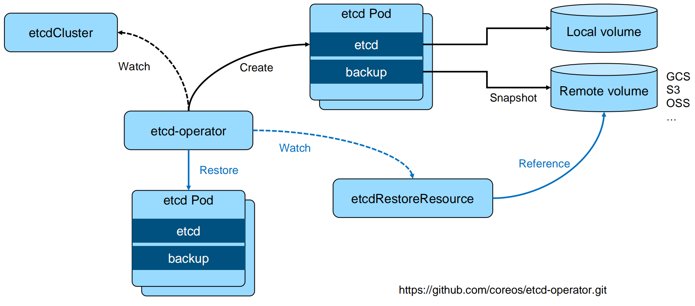

# 高可用集群管理
## 小练习
高可用 etcd 集群搭建

## 高可用etcd解决方案
etcd-operator: coreos 开源的，基于 kubernetes CRD 完成 etcd 集群配置。Archived [https//github.com/coreos/etcd-operator](https//github.com/coreos/etcd-operator)

Etcd statefulset Helm chart: Bitnami(powered by vmware) <br>
[https://bitnami.com/stack/etcd/helm](https://bitnami.com/stack/etcd/helm)<br>
[https://github.com/bitnami/charts/blob/master/bitnami/etcd](https://github.com/bitnami/charts/blob/master/bitnami/etcd)<br>

## Etcd Operator


[https://github.com/coreos/etcd-operator.git](https://github.com/coreos/etcd-operator.git)

## 基于 Bitnami 安装 etcd
- 安装 helm

[https://github.com/helm/helm/releases](https://github.com/helm/helm/releases)

- 通过 helm 安装 etcd

helm repo add bitnami [https://charts.bitnami.com/bitnami](https://charts.bitnami.com/bitnami)<br>
helm install my-release bitnami/etcd

- 通过客户端与serve交互
```
kubectl run my-release-etcd-client --restart=,Never, --image docker.io/bitnami/etcd:3.5.0-debian-10-r94 --env ROOT_PASSWORD=$(kubectl get secret --namespace default my-release-etcd -o jsonpath=H(-data.etcd-root-password}H | base64 --decode) --env ETCDCTL_ENDPOINTS="my-release- etcd.default.svc.cluster.local:2379H --namespace default --command -- sleep infinity
```

## Kubernetes 如何使用 etcd
etcd 是 kubernetes 的后端存储

对于每一个 kubernetes Object，都有对应的 storage.go 负责对象的存储操作

- pkg/registry/core/pod/storage/storage.go

API server启动脚本中指定etcd servers集群
```
spec:
  containers:
  - command:
    - kube-apiserver
    - --advertise-address=192.168.34.2
    - --enable-bootstrap-token-auth=true
    - --etcd-cafile=/etc/kubernetes/pki/etcd/ca.crt
    - --etcd-certfile=/etc/kubernetes/pki/apiserver-etcd-client.crt
    - --etcd-keyfile=/etc/kubernetes/pki/apiserver-etcd-client.key
    - --etcd-servers=https://127.0.0.1:2379
```

早期 API server 对 etcd 做简单的 Ping check，现在已经改为真实的 etcd api call

## Kubernets对象在etcd中的存储路径
- ks exec -it etcd-cadmin sh
- ETCDCTL_API=3
```
alias ectl='etcdctl —endpoints https://127.0.0.1:2379 \
--cacert /etc/kubernetes/pki/etcd/ca.crt \
--cert /etc/kubernetes/pki/etcd/server.crt \
--key /etc/kubernetes/pki/etcd/server.key'
```
```
ectl get --prefix --keys-only /
/registry/namespaces/calico-apiserver 
/registry/networkpolicies/calico-apiserver/allow-apiserver 
/registry/operator.tigera.io/tigerastatuses/apiserver 
/registry/pops/calico-apiserver/calico-apiserver-77dffffcdf-g2tcx
/registry/pops/default/toolbox-68f79dd5f8-4664n
```

## etcd在集群中所处的位置


## Kubernetes 如何使用 etcd
etcd 是 kubernetes 的后端存储

对于每一个 kubernetes Object，都有对应的 storage.go 负责对象的存储操作

- pkg/registry/core/pod/storage/storage.go

API server启动脚本中指定 etcd servers 集群

- ```/usr/local/bin/kube-apiserver --etcd_servers=https://localhost:4001 --etcd- cafile=/etc/ssl/kubernetes/ca.crt--storage-backend=etcd3 --etcd-servers- overrides=/events#https://localhost:4002```

## etcd
堆叠式 etcd 集群的高可用拓扑

- 这种拓扑将相同节点上的控制平面和 etcd 成员耦合在一起。优点在于建立起来非常容易，并且对副本的管理也更容易。但是，堆叠式存在耦合失败的风险。如果一个节点发生故障，则 etcd 成员和控制平面实例都会丢失，并且集群冗余也会受到损害。可以通过添加更多控制平面节点来减轻这种风险。因此为实现集群高可用应该至少运行三个堆叠的 Master 节点。


外部 etcd 集群的高可用拓扑

- 该拓扑将控制平面和 etcd 成员解耦。如果丢失一个 Master 节点，对 etcd 成员的影响较小，并且不会像堆叠式拓扑那样对集群冗余产生太大影响。但是，此拓扑所需的主机数量是堆叠式拓扑的两倍。具有此拓扑的群集至少需要三个主机用于控制平面节点，三个主机用于 etcd 集群。


## 实践 - etcd集群高可用
多少个 peer 最适合？

- 1个？3个？5个？
- 保证高可用是首要目标
- 所有写操作都要经过 leader
- peer 多了是否能提升集群并读操作的并发能力？
    - apiserver 的配置只连本地的 etcd peer
    - apiserver 的配置指定所有 etcd peers，但只有当前连接的 etcd member 异常，apiserver才会换目标
- 需要动态 flex up 吗？

保证 apiserver 和 etcd 之间的高效性通讯

- apiserver 和 etcd 部署在同一节点
- apiserver 和 etcd 之间的通讯基于 gRPC
    - 针对每一个 object，apiserver 和 etcd 之间的 Connection -> stream 共享
    - http2 的特性
        - Stream quota
        - 带来的问题？对于大规模集群，会造成链路阻塞
        - 10000个pod，—次 list 操作需要返回的数据可能超过 100M
            - k get pod --all-namespaces|wc -L
            - 8520
            - k get pod -oyaml --all-namespaces>pops
            - Is -l pops
            - -rw-r--r-- 1 root root 75339736 Apr 5 03:13 pops

## 实践 - etcd存储规划
本地VS远程？

- Remote Storage
    - 优势是假设永远可用，现实真是如此吗?
    - 劣势是 IO 效率，可能带来的问题？
- 最佳实践：
    - LocalSSD 
    - 利用 local volume 分配空间
- 多少空间？
    - 与集群规模相关/思考：为什么每个 member 的 DB size 不一致?


## etcd
安全性

- peer 和 peer 之间的通讯加密
    - 是否有需求
        - TLS 的额外开销
        - 运营复杂度增加
- 数据加密
    - 是否有需求?
    - Kubernetes 提供了针对 secret 的加密
        - https://kubernetes.io/docs/tasks/administer-cluster/encrypt-data/

事件分离

- 对于大规模集群，大量的事件会对 etcd 造成压力
- API server 启动脚本中指定 etcd server 集群
    - /usr/local/bin/kube-apiserver —etcd_servers=https://localhost:4001 —etcd- cafile=/etc/ssl/kubernetes/ca.crt—storage-backend=etcd3 —etcd-servers- 
    overrides=/events#https://localhost:4002

如何监控?

## 减少网络延迟
减少网络延迟

- 数据中心内的RTT大概是数毫秒，国内的典型RTT约为50ms，两大洲之间的RTT可能慢至 400ms。因此建议 etcd 集群尽量同地域部署。
- 当客户端到 Leader 的并发连接数量过多，可能会导致其他 Follower 节点发往 Leader 的请求因 为网络拥塞而被延迟处理。在 Follower 节点上，可能会看到这样的错误：
    - dropped MsgProp to 247ae21ff9436b2d since streamMsg's sending buffer is full
- 可以在节点上通过流量控制工具 (Traffic Control) 提高 etcd 成员之间发送数据的优先级来避免。

## 减少磁盘I/O延迟
对于磁盘延迟，典型的旋转磁盘写延迟约为10毫秒。对于 SSD （Solid State Drives，固态硬盘）， 延迟通常低于1毫秒。HDD （Hard Disk Drive，硬盘驱动器）或者网盘在大量数据读写操作的情况下延时会不稳定。因此强烈建议使用 SSD。

同时为了降低其他应用程序的 I/O 操作对 etcd 的干扰，建议将 etcd 的数据存放在单独的磁盘内。也可以将不同类型的对象存储在不同的若干个 etcd 集群中，比如将频繁变更的 event 对象从主 etcd  集群中分离出来，以保证主集群的高性能。在 APIServer 处这是可以通过参数配置的。这些 etcd 集 群最好也分别能有一块单独的存储磁盘。

如果不可避免地，etcd 和其他的业务共享存储磁盘，那么就需要通过下面 ionice 命令对 etcd 服务 设置更高的磁盘 I/O 优先级，尽可能避免其他进程的影响。
```
$ ionice -c2 -n0 -p 'pgrep etcd'
```

## 保持合理的日志文件大小

etcd以日志的形式保存数据，无论是数据创建还是修改，它都将操作追加到日志文件，因此日志 文件大小会随着数据修改次数而线性增长。

当Kubernetes集群规模较大时，其对etcd集群中的数据更改也会很频繁，集群日记文件会迅速增 长。
 	
为了有效降低日志文件大小，etcd会以固定周期创建快照保存系统的当前状态，并移除旧日志文 件。另外当修改次数累积到一定的数量（默认是10000,通过参数"--snapshot-count"指定）， etcd也会创建快照文件。

如果etcd的内存使用和磁盘使用过高，可以先分析是否数据写入频度过大导致快照频度过高，确 认后可通过调低快照触发的阈值来降低其对内存和磁盘的使用。

## 设置合理的存储配额
存储空间的配额用于控制etcd数据空间的大小。合理的存储配额可保证集群操作的可靠性。如果 没有存储配额，也就是etcd可以利用整个磁盘空间，etcd的性能会因为存储空间的持续增长而严 重下降，甚至有耗完集群磁盘空间导致不可预测集群行为的风险。如果设置的存储配额太小，一 旦其中一个节点的后台数据库的存储空间超出了存储配额，etcd就会触发集群范围的告警，并将 集群置于只接受读和删除请求的维护模式。只有在释放足够的空间、消除后端数据库的碎片和清 除存储配额告警之后，集群才能恢复正常操作。

## 自动压缩历史版本
etcd会为每个键都保存了历史版本。为了避免出现性能问题或存储空间消耗完导致写不进去的问 题，这些历史版本需要进行周期性地压缩。压缩历史版本就是丢弃该键给定版本之前的所有信息, 节省出来的空间可以用于后续的写操作。etcd支持自动压缩历史版本。在启动参数中指定参数"--auto-compaction"，其值以小时为单位。也就是etcd会自动压缩该值设置的时间窗口之前的 历史版本。

## 定期消除碎片化
压缩历史版本，相当于离散地抹去etcd存储空间某些数据，etcd存储空间中将会出现碎片。这些 碎片无法被后台存储使用，却仍占据节点的存储空间。因此定期消除存储碎片，将释放碎片化的 存储空间，重新调整整个存储空间。

- 备份方案
    - etcd备份：备份完整的集群信息，灾难恢复
        - etcdctl snapshot save
    - 备份Kubernetes	event
- 频度？
    - 时间间隔太长：
        - 能否接受user data lost?
        - 如果有外部资源配置，如负载均衡等，能否接受数据丢失导致的leak?
    - 时间间隔太短：
        - 对etcd的影响
            - 做snapshot的时候，etcd会锁住当前数据
            - 并发的写操作需要开辟新的空间进行增量写，导致磁盘空间增长
- 如何保证备份的时效性，同时防止磁盘爆掉？
    - Auto defrag?

## 优化运行参数
当网络延迟和磁盘延迟固定的情况下，可以优化 etcd 运行参数来提升集群的工作效率。etcd 基于 Raft 协议进行 Leader 选举，当 Leader 选定以后才能开始数据读写操作，因此频繁的 Leader 选举会导致数据读写性能显著降低。可以通过调整心跳周期(Heatbeat Interval) 和选举超时时间 (Election Timeout)，来降低 Leader 选举的可能性。

心跳周期是控制 Leader 以何种频度向 Follower 发起心跳通知。心跳通知除表明 Leader 活跃状态之外， 还带有待写入数据信息，Follower 依据心跳信息进行数据写入，默认心跳周期是100ms。选举超时时间定义了当 Follower 多久没有收到 Leader 心跳，则重新发起选举，该参数的默认设置是1000ms。

如果 etcd 集群的不同实例部署在延迟较低的相同数据中心，通常使用默认配置即可。如果不同实例部署在多数据中心或者网络延迟较高的集群环境，则需要对心跳周期和选举超时时间进行调整。建议心跳周期参数推荐设置为接近 etcd 多个成员之间平均数据往返周期的最大值，一般是平均RTT的0.55-1.5倍。 如果心跳周期设置得过低，etcd 会发送很多不必要的心跳信息，从而增加 CPU 和网络的负担。如果设置 得过高，则会导致选举频繁超时。选举超时时间也需要根据 etcd 成员之间的平均 RTT 时间来设置。选举超时时间最少设置为 etcd 成员之间 RTT 时间的 10 倍，以便对网络波动。

心跳间隔和选举超时时间的值必须对同一个 etcd 集群的所有节点都生效，如果各个节点配置不同,就会导致集群成员之间协商结果不可预知而不稳定。

## etcd 备份存储
etcd 的默认工作目录下会生成两个子目录：waf 和 snap。wal 是用于存放预写式日志，其最大的作用是记录整个数据变化的全部历程。所有数据的修改在提交前，都要先写入 wal 中。

snap 是用于存放快照数据。为防止 wal 文件过多，etcd 会定期（当 wal 中数据超过10000条记录 时，由参数"snapshot-count"设置）创建快照。当快照生成后，wal 中数据就可以被删除了。

如果数据遭到破坏或错误修改需要回滚到之前某个状态时，方法就有两个：一是从快照中恢复数据主体，但是未被拍入快照的数据会丢失；而是执行所有 WAL 中记录的修改操作，从最原始的数据恢复到数据损坏之前的状态，但恢复的时间较长。

## 备份方案实践
官方推荐 etcd 集群的备份方式是定期创建快照。

根据集群对 etcd 备份粒度的要求，可适当调节备份的周期。在生产环境中实测，拍摄快照通常会影响集群当时 的性能,因此不建议频繁创建快照。

但是备份周期太长，就可能导致大量数据的丢失。

这里可以使用增量备份的方式。


