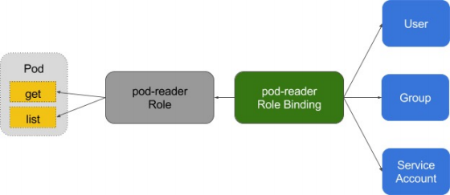

## 授权


授权主要是用于对集群资源的访问控制, 通过检查请求包含的相关属性值, 与相对应的访问策略相比较, API请求必须满足某些策略才能被处理. 跟认证类似, Kubernetes 也支持多种授权机制, 并支持同时开启多个授权插件(只要有一个验证通过即可). 如果授权成功, 则用户的请求会发送到准入控制模块做进一步的请求验证; 对于授权失败的请求则返回 HTTP 403. 

Kubernetes授权仅处理以下的请求属性: 

- user, group, extra
- API、请求方法(如get 、post 、update 、patch 和 delete)和请求路径(如/api)
- 请求资源和子资源
- Namespace
- API Group

目前, Kubernetes 支持以下授权插件: 

- ABAC
- RBAC
- Webhook
- Node

## RBAC vs ABAC

ABAC (Attribute Based Access Control) 本来是不错的概念, 但是在 Kubernetes 中的实现比较难于管理和理解, 而且需要对 Master 所在节点的 SSH 和文件系统权限, 要使得对授权的变更成功生效, 还需要重新启动 API Server. 

而 RBAC 的授权策略可以利用 kubectl 或者 Kubernetes API 直接进行配置. RBAC 可以授权给用户, 让用户有权进行授权管理, 这样就可以无需接触节点, 直接进行授权管理. RBAC 在 Kubernetes 中被映射为 API 资源和操作. 
### RBAC老图

### RBAC新解

## Role与ClusterRole
Role (角色)是一系列权限的集合, 例如一个角色可以包含读取 Pod 的权限和列出 Pod 的权限. Role 只能用来给某个特定 namespace 中的资源作鉴权, 对多 namespace 和集群级的资源或者是非资源类的API (如 /healthz) 使用 ClusterRole. 
```
# Role示例
kind: Role
apiVersion: rbac.authorization.k8s.io/v1
metadata:
  namespace: default
  name: pod-reader
rules:
- apiGroups: [""] # "" indicates the core API group
  resources: ["pods"]
  verbs: ["get", "watch", "list"]
```

```
# ClusterRole示例
kind: ClusterRole
apiVersion: rbac.authorization.k8s.io/v1
metadata:
  # "namespace" omitted since ClusterRoles are not namespaced
  name: secret-reader
rules:
- apiGroups: [""]
  resources: ["secrets"]
  verbs: ["get", "watch", "list"]
```
## binding
```
# RoleBinding示例(引用ClusterRole)
# This role binding allows "dave" to read secrets in the "development"
kind: RoleBinding
apiVersion: rbac.authorization.k8s.io/v1
metadata:
  name: read-secrets
  namespace: development # This only grants permissions within the
subjects:
- kind: User
  name: dave
  apiGroup: rbac.authorization.k8s.io
roleRef:
  kind: ClusterRole
  name: secret-reader
  apiGroup: rbac.authorization.k8s.io
```


## 账户\组的管理
角色绑定(Role Binding)  是将角色中定义的权限赋予一个或者一组用户. 它包含若干 主体  (用户、组或服务账户)的列表和对这些主体所获得的角色的引用. 

组的概念: 
- 当与外部认证系统对接时, 用户信息 (UserInfo) 可包含 Group 信息, 授权可针对用户群组
- 当对 ServiceAccount 授权时, Group 代表某个 Namespace 下的所有 ServiceAccount


## 针对群租授权
```
apiVersion: rbac.authorization.k8s.io/v1
kind: ClusterRoleBinding
metadata:
  name: read-secrets-global
subjects:
- kind: Group
  name: manager # 'name' 是区分大小写的
  apiGroup: rbac.authorization.k8s.io
roleRef:
  kind: ClusterRole
  name: secret-reader
  apiGroup: rbac.authorization.k8s.io
```

```
apiVersion: rbac.authorization.k8s.io/v1
kind: ClusterRoleBinding
metadata:
 name: read-secrets-global
subjects:
- kind: Group
  name: system:serviceaccounts:qa
  apiGroup: rbac.authorization.k8s.io
roleRef:
  kind: ClusterRole
  name: secret-reader
  apiGroup: rbac.authorization.k8s.io
```
## 规划系统角色
User

- 管理员
- 所有资源的所有权限？？
- 普通用户
- 是否有该用户创建的namespace下的所有object的操作权限？
- 对其他用户的namespace资源是否可读, 是否可写？

SystemAccount

- SystemAccount是开发者(kubernetes developer或者domain developer)创建应用后, 应 用于apiserver通讯需要的身份
- 用户可以创建自定的 ServiceAccount, kubernetes 也为每个 namespace 创建 default ServiceAccount
- Default ServiceAccount 通常需要给定权限以后才能对 apiserver 做写操作

## 实现方案
在 cluster 创建时, 创建自定义的 role, 比如 namespace-creator

Namespace-creator role 定义用户可操作的对象和对应的读写操作. 

创建自定义的 namespace admission controller

- 当 namespace 创建请求被处理时, 获取当前用户信息并 annotate 到 namespace 创建 RBAC controller
- Watch namespace 的创建事件
- 获取当前 namespace 的创建者信息
- 在当前 namespace 创建 rolebinding 对象, 并将 namespace-creator 角色和用户绑定

## 与权限相关的其他最佳实践
ClusterRole 是非 namespace 绑定的, 针对整个集群生效<br>
通常需要创建一个管理员角色, 并且绑定给开发运营团队成员<br>
ThirdPartyResource和CustomResourceDefinition是全局资源, 普通用户创建 ThirdPartyResource以后, 需要管理员授予相应权限后才能真正操作该对象<br>
针对所有的角色管理, 建议创建spec, 用源代码驱动<br>

- 虽然可以通过edit操作来修改权限, 但后期会导致权限管理混乱, 可能会有很多临时创建出来的 角色和角色绑定对象, 重复绑定某一个资源权限

权限是可以传递的, 用户A可以将其对某对象的某操作, 抽取成一个权限, 并赋给用户B<br>
防止海量的角色和角色绑定对象, 因为大量的对象会导致鉴权效率低, 同时给apiserver增加负担 ServiceAccount也需要授权的, 否则你的component可能无法操作某对象<br>
Tips: SSH到master节点通过insecure port访问apiserver可绕过鉴权, 当需要做管理操作又没 有权限时可以使用(不推荐)<br>

## 运营过程中出现的陷阱
案例1:

- 研发人员为提高系统效率, 将 update 方法修改为 patch
- 研发人员本地非安全测试环境测试通过
- 上生产, 发现不 work
- 原因: 忘记更新 rolebinding, 对应的 serviceaccount 没有 patch 权限

案例2:

- 研发人员创建 CRD, 并针对该 CRD 编程
- 上生产后不工作
- 原因, 该 CRD 未授权, 对应的组件 get 不到对应的 CRD 资源
