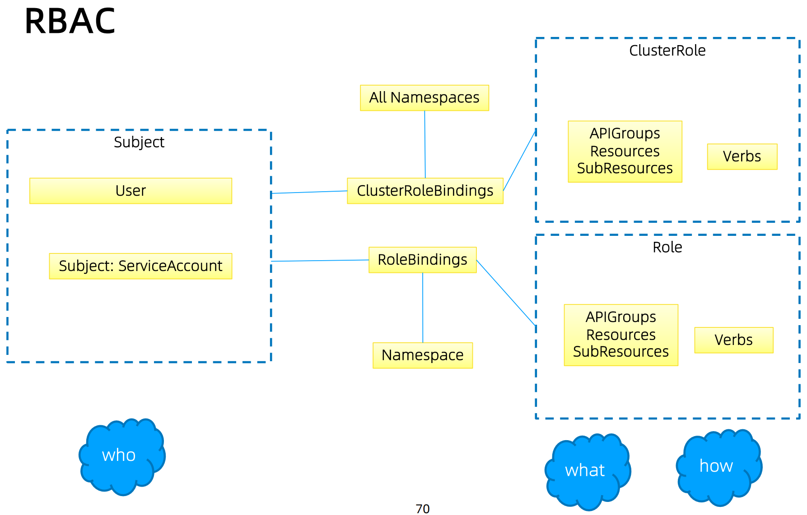

## 启动 apiserver 示例
```
kube-apiserver --feature-gates=AllAlpha=true --runtime-config=api/all=true \
--requestheader-allowed-names=front-proxy-client \
--client-ca-file=/etc/kubernetes/pki/ca.crt \
--allow-privileged=true \
--experimental-bootstrap-token-auth=true \
--storage-backend=etcd3 \
--requestheader-username-headers=X-Remote-User \
--requestheader-extra-headers-prefix=X-Remote-Extra- \
--service-account-key-file=/etc/kubernetes/pki/sa.pub \
--tls-cert-file=/etc/kubernetes/pki/apiserver.crt \
--tls-private-key-file=/etc/kubernetes/pki/apiserver.key \
--kubelet-client-certificate=/etc/kubernetes/pki/apiserver-kubelet-client.crt \
--requestheader-client-ca-file=/etc/kubernetes/pki/front-proxy-ca.crt \
--enabled-hooks=NamespaceLifecycle,LimitRanger,ServiceAccount,PersistentVolumeLabel,DefaultStorageClass,ResourceQuota \
--requestheader-group-headers=X-Remote-Group \
--kubelet-client-key=/etc/kubernetes/pki/apiserver-kubelet-client.key \
--secure-port=6443 \
--kubelet-preferred-address-types=InternalIP,ExternalIP,Hostname \
--service-cluster-ip-range=10.96.0.0/12 \
--advertise-address=192.168.0.20 --etcd-servers=http://127.0.0.1:2379
```

## 构建高可用的多副本 apiserver

apiserver 是无状态的 Rest Server<br>
无状态所以方便 Scale Up/down<br>

负载均衡

- 在多个 apiserver 实例之上, 配置负载均衡
- 证书可能需要加上 Loadbalancer VIP 重新生成

## 预留充足的 CPU、内存资源

随着集群中节点数量不断增多, APIServer 对 CPU 和内存的开销也不断增大. 过少的 CPU 资源会降低其处理效率, 过少的内存资源会导致 Pod 被 OOMKilled, 直接导致服务不可用. 在规划 APIServer资源时, 不能仅看当下需求, 也要为未来预留充分. 

## 善用速率限制(RateLimit)

APIServer的参数"--max-requests-inflight"和"--max-mutating-requests-inflight"支持在给定时间内限制并行处理读请求(包括 Get、List 和 Watch 操作)和写请求(包括Create、Delete、Update 和 Patch 操作)的最大数量. 当 APIServer 接收到的请求超过这两个参数设定的值时, 再接收到的请求将会被直接拒绝. 通过速率限制机制, 可以有效地控制 APIServer 内存的使用. 如果该值配置过低, 会经常出现请求超过限制的错误, 如果配置过高, 则 APIServer 可能会因为占用过多内存而被强制终止, 因此需要根据实际的运行环境, 结合实时用户请求数量和 APIServer 的资源配置进行调优.

客户端在接收到拒绝请求的返回值后, 应等待一段时间再发起重试, 无间隔的重试会加重 APIServer 的压力, 导致性能进一步降低. 针对并行处理请求数的过滤颗粒度太大, 在请求数量比较多的场景, 重要的消息可能会被拒绝掉, 自 1.18 版本开始, 社区引入了优先级和公平保证 (Priority and Fairness)功能, 以提供更细粒度地客户端请求控制. 该功能支持将不同用户或不同类型的请求进行优先级归类, 保证高优先级的请求总是能够更快得到处理, 从而不受低优先级请求的影响. 

## 设置合适的缓存大小

APIServer 与 etcd 之间基于 gRPC 协议进行通信, gRPC 协议保证了二者在大规模集群中的数据高速传输. gRPC 基于连接复用的 HTTP/2 协议, 即针对相同分组的对象, APIServer 和 etcd 之间共享相同的 TCP 连接, 不同请求由不同的 stream 传输. 

一个 HTTP/2 连接有其 stream 配额 , 配额的大小限制了能支持的并发请求. APIServer 提供了集群对象的缓存机制, 当客户端发起查询请求时, APIServer 默认会将其缓存直接返回给客户端. 缓存区大小可以通过参数 "--watch-cache-sizes" 设置. 针对访问请求比较多的对象, 适当设置缓存的大小, 极大降低对 etcd 的访问频率, 节省了网络调用, 降低了对 etcd 集群的读写压力, 从而提高对象访问的性能. 

但是 APIServer 也是允许客户端忽略缓存的, 例如客户端请求中 ListOption 中没有设置 resourceVersion, 这时 APIServer 直接从 etcd 拉取最新数据返回给客户端. 客户端应尽量避免此操作, 应在 ListOption 中设置 resourceVersion 为 0, APIServer 则将从缓存里面读取数据, 而不会直接访问 etcd. 

## 客户端尽量使用长连接

当查询请求的返回数据较大且此类请求并发量较大时, 容易引发 TCP 链路的阻塞, 导致其他查询操作超时. 因此基于 Kubernetes 开发组件时, 例如某些 DaemonSet 和 Controller, 如果要查询某类对象, 应尽量通过长连接 ListWatch 监听对象变更, 避免全量从 APIServer 获取资源. 如果在同一应用程序中, 如果有多个 Informer 监听 APIServer 资源变化, 可以将这些 Informer 合并, 减少和 APIServer 的长连接数, 从而降低对 APIServer 的压力. 

## 如何访问APIServer

对外部客户(user/client/admin), 永远只通过 LoadBalancer 访问<br>
只有当负载均衡出现故障时, 管理员才切换到 apiserver IP 进行管理<br>
内部客户端, 优先访问 cluster IP？(是否一定如此？)


## 搭建多租户的Kubernetes集群

- 授信
    - 认证: 
        - 禁止匿名访问, 只允许可信用户做操作. 
    - 授权: 
        - 基于授信的操作, 防止多用户之间互相影响, 比如普通用户删除 Kubernetes 核心服务, 或者 A 用户删除或修改 B 用户的应用. 
- 隔离
    - 可见行隔离: 
        - 用户只关心自己的应用, 无需看到其他用户的服务和部署. 
    - 资源隔离: 
        - 有些关键项目对资源需求较高, 需要专有设备, 不与其他人共享. 
    - 应用访问隔离: 
        - 用户创建的服务, 按既定规则允许其他用户访问. 
- 资源管理
    - Quota管理
        - 谁能用多少资源？

## 认证

- 与企业现有认证系统集成
    - 很多企业基于 Microsoft Active Directory 提供认证服务
- 选择认证插件
    - 选择 webhook 作为认证插件(*以此为例展开)
    - 也可以选择 Keystone 作为认证插件, 以 Microsoft Ad 作为 backend 搭建 keystone 服务

一旦认证完成, Kubernetes 即可获取当前用户信息(主要是用户名), 并针对该用户做授权. 授权和准入控制完成后, 该用户的请求完成. 

## 注册APIService
```
apiVersion: apiregistration.k8s.io/v1
kind: APIService
metadata:
labels:
  kube-aggregator.kubernetes.io/automanaged: onstart
  name: v1.
spec:
  groupPriorityMinimum: 18000
  version: v1
  versionPriority: 1
status:
  conditions:
  - lastTransitionTime: "2020-08-16T05:35:33Z"
    message: Local APIServices are always available
    reason: Local
    status: "True"
    type: Available
```
## 授权

ABAC 有期局限性, 针对每个 account 都需要做配置, 并且需要重启 apiserver 

RBAC 更灵活, 更符合我们通常熟知的权限管理

## RBAC


## 规划系统角色
- User
    - 管理员
        - 所有资源的所有权限？？
    - 普通用户
        - 是否有该用户创建的 namespace 下的所有 object 的操作权限？
        - 对其他用户的 namespace 资源是否可读, 是否可写？
- SystemAccount
    - SystemAccount 是开发者 (kubernetes developer 或者 domain developer) 创建应用后, 应用于 apiserver 通讯需要的身份
    - 用户可以创建自定的 ServiceAccount, kubernetes 也为每个 namespace 创建 default ServiceAccount
    - Default ServiceAccount 通常需要给定权限以后才能对 apiserver 做写操作

## 实现方案

在 cluster 创建时(kube-up.sh), 创建自定义的 role, 比如 namespace-creator namespace-creator role 定义用户可操作的对象和对应的读写操作. 

- 创建自定义的 namespace admission controller
    - 当 namespace 创建请求被处理时, 获取当前用户信息并 annotate (注释)到 namespace 
- 创建 RBAC controller
    - Watch namespace 的创建事件
    - 获取当前 namespace 的创建者信息
    - 在当前 namespace 创建 rolebinding 对象, 并将 namespace-creator 角色和用户绑定
## 与权限相关的其他最佳实践

ClusterRole 是非 namespace 绑定的, 针对整个集群生效<br>
通常需要创建一个管理员角色, 并且绑定给开发运营团队成员<br>
ThirdPartyResource 和 CustomResourceDefinition 是全局资源, 普通用户创建 ThirdPartyResource 以后, 需要管理员授予相应权限后才能真正操作该对象<br>

- 针对所有的角色管理, 建议创建spec, 用源代码驱动
    - 虽然可以通过 edit 操作来修改权限, 但后期会导致权限管理混乱, 可能会有很多临时创建出来的角色和角色绑定对象, 重复绑定某一个资源权限

权限是可以传递的, 用户 A 可以将其对某对象的某操作, 抽取成一个权限, 并赋给用户 B<br>
防止海量的角色和角色绑定对象, 因为大量的对象会导致鉴权效率低, 同时给 apiserver 增加负担 ServiceAccount 也需要授权的, 否则你的 component 可能无法操作某对象<br>
Tips: SSH 到 master 节点通过 insecure port 访问 apiserver 可绕过鉴权, 当需要做管理操作又没有权限时可以使用(不推荐)
